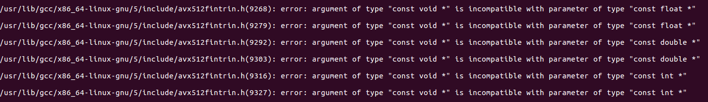
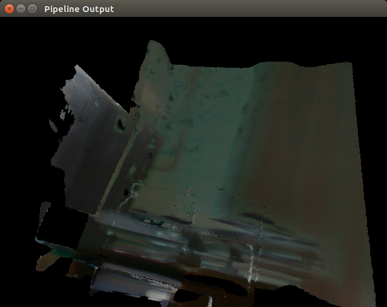

# KinectFusionApp

* [KinectFusionAppLib_comments](https://github.com/DreamWaterFound/KinectFusionAppLib_comments): 泡泡机器人线下会议公开，自己对KinectFusionApp和KinectFusionLib的源码注释

---

This is a sample application using the [KinectFusionLib](https://github.com/chrdiller/KinectFusionLib). It implements cameras (for data acquisition from recordings as well as from a live depth sensor) as data sources. The resulting fused volume can then be exported into a pointcloud or a dense surface mesh.

## Dependencies

### GCC 5.4

* Ubuntu16.04存在gcc-5.5.0的情况下安装gcc-5.4.0
  ```bash
  # 下载gcc源码并解压
  # [https://ftp.gnu.org/gnu/gcc/gcc-5.4.0/](https://ftp.gnu.org/gnu/gcc/gcc-5.4.0/)
  cd gcc-5.4.0
  ./contrib/download_prerequisites
  cd ..
  mkdir gcc-build-5.4.0
  cd gcc-build-5.4.0
  ../gcc-5.4.0/configure --enable-checking=release --enable-languages=c,c++ --disable-multilib
  make -j8
  sudo make install

  # 软连接
  sudo unlink /usr/bin/gcc && sudo ln -s /usr/local/bin/gcc /usr/bin/gcc
  sudo unlink /usr/bin/g++ && sudo ln -s /usr/local/bin/g++ /usr/bin/g++
  ```

### CUDA 8.0

* 因CUDA8.0默认gcc 5.4.0，我Ubuntu16.04中最低gcc5.5.0，编译KF报错如下；将gcc降到5.4.0后，问题解决（ref: [https://github.com/tensorflow/tensorflow/issues/10220](https://github.com/tensorflow/tensorflow/issues/10220)）

  

* **CUDA 8.0** or higher. In order to provide real-time reconstruction, this library relies on graphics hardware. Running it exclusively on CPU is not possible. Adjust CUDA architecture: Set the CUDA architecture version to that of your graphics hardware.
  
  ```cmake
  set(CUDA_NVCC_FLAGS ${CUDA_NVCC_FLAGS};-O3 -gencode arch=compute_52,code=sm_52)
  ```

  Tested with a **nVidia GeForce GTX 1060, compute capability 6.1, Pascal architecture**:
  ```
  ./deviceQuery Starting...

  CUDA Device Query (Runtime API) version (CUDART static linking)

  Detected 1 CUDA Capable device(s)

  Device 0: "GeForce GTX 1060 3GB"
    CUDA Driver Version / Runtime Version          9.0 / 8.0
    CUDA Capability Major/Minor version number:    6.1
    Total amount of global memory:                 3014 MBytes (3160276992 bytes)
    ( 9) Multiprocessors, (128) CUDA Cores/MP:     1152 CUDA Cores
    GPU Max Clock rate:                            1759 MHz (1.76 GHz)
    Memory Clock rate:                             4004 Mhz
    Memory Bus Width:                              192-bit
    L2 Cache Size:                                 1572864 bytes
    Maximum Texture Dimension Size (x,y,z)         1D=(131072), 2D=(131072, 65536), 3D=(16384, 16384, 16384)
    Maximum Layered 1D Texture Size, (num) layers  1D=(32768), 2048 layers
    Maximum Layered 2D Texture Size, (num) layers  2D=(32768, 32768), 2048 layers
    Total amount of constant memory:               65536 bytes
    Total amount of shared memory per block:       49152 bytes
    Total number of registers available per block: 65536
    Warp size:                                     32
    Maximum number of threads per multiprocessor:  2048
    Maximum number of threads per block:           1024
    Max dimension size of a thread block (x,y,z): (1024, 1024, 64)
    Max dimension size of a grid size    (x,y,z): (2147483647, 65535, 65535)
    Maximum memory pitch:                          2147483647 bytes
    Texture alignment:                             512 bytes
    Concurrent copy and kernel execution:          Yes with 2 copy engine(s)
    Run time limit on kernels:                     Yes
    Integrated GPU sharing Host Memory:            No
    Support host page-locked memory mapping:       Yes
    Alignment requirement for Surfaces:            Yes
    Device has ECC support:                        Disabled
    Device supports Unified Addressing (UVA):      Yes
    Device PCI Domain ID / Bus ID / location ID:   0 / 1 / 0
    Compute Mode:
      < Default (multiple host threads can use ::cudaSetDevice() with device simultaneously) >

  deviceQuery, CUDA Driver = CUDART, CUDA Driver Version = 9.0, CUDA Runtime Version = 8.0, NumDevs = 1, Device0 = GeForce GTX 1060 3GB
  Result = PASS
  ```

### OpenCV 3

* **OpenCV 3.0** or higher. This library heavily depends on the GPU features of OpenCV that have been refactored in the 3.0 release. Therefore, OpenCV 2 is not supported.
  ```sh
  #!/bin/sh
  cmake \
      -D CMAKE_BUILD_TYPE=Release \
      -D CMAKE_INSTALL_PREFIX=/opt/opencv_34 \
      -D BUILD_TESTS=OFF \
      -D WITH_VTK=OFF \
      -D WITH_MATLAB=OFF \
      -D WITH_TBB=ON \
      -D WITH_IPP=OFF \
      -D WITH_FFMPEG=OFF \
      -D WITH_V4L=ON \
      -D WITH_CUDA=ON \
      -D CUDA_GENERATION=Pascal \
      -D ENABLE_PRECOMPILED_HEADERS=OFF \
      -D OPENCV_EXTRA_MODULES_PATH=../opencv_contrib/modules \
      ../opencv/
  ```

### Eigen3

* **Eigen3** for efficient matrix and vector operations.

### Sensors

#### Realsense

* **librealsense2-dev** for data acquisition with a live depth sensor.

#### Kinect

* [Ubuntu16.04 Kinect V1相机驱动安装方法（无Ros)](https://blog.csdn.net/qq_42037180/article/details/97704945)

* [Ubuntu16.04安装OpenNI2](https://blog.csdn.net/renhaofan/article/details/80991095)

## Usage

Setup the data sources in main.cpp. Then, start the application.

Use the following keys to perform actions:
* 'p': Export all camera poses known so far
* 'm': Export a dense surface mesh
* ' ': Export nothing, just end the application
* 'a': Save all available data

### run with Realsense D435i

```sh
./KinectFusionApp/KinectFusionApp -c ../KinectFusionApp/config.toml
```


